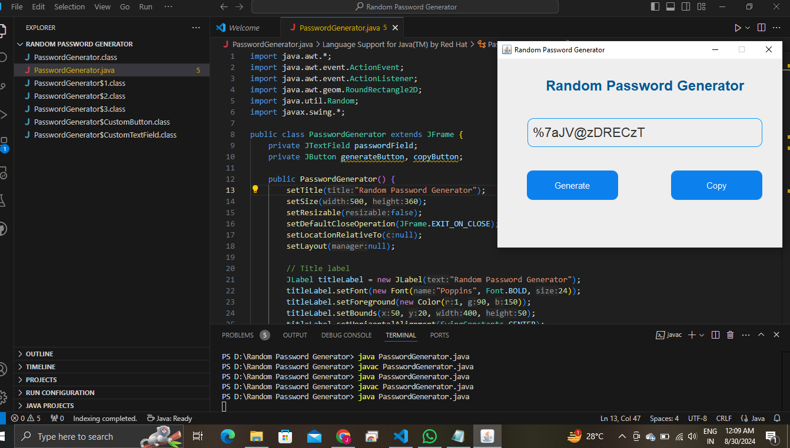

# Random Password Generator

This is a Random Password Generator application built using Java Swing and AWT. It allows users to generate secure, random passwords and copy them to the clipboard with ease.

## Features

- **Random Password Generation:** Generates secure passwords containing numbers, uppercase and lowercase letters, and special characters.
- **Copy to Clipboard:** Easily copy the generated password to the clipboard with a single click.
- **Curved UI Elements:** Aesthetic design with curved text fields and buttons.

## How It Works

- The application has a text field to display the generated password.
- Click the `Generate` button to create a new random password.
- Click the `Copy` button to copy the generated password to the clipboard.

## Code Structure

- **PasswordGenerator Class:** Implements the GUI and logic for generating and copying passwords using Java Swing and AWT.
- **Custom Components:** Custom text fields and buttons with curved edges for enhanced UI design.
- **ActionListener:** Handles button click events for generating and copying the password.

## Getting Started

### Prerequisites

To run this project, you need:

- [Java JDK](https://www.oracle.com/java/technologies/javase-downloads.html) installed on your system.

### Running the Project

-**Compile and run the program:**

    ```bash
    javac PasswordGenerator.java
    java PasswordGenerator
    ```

### Example Usage

1. Open the application.
2. Click the `Generate` button to create a random password.
3. Click the `Copy` button to copy the generated password to your clipboard.

## Screenshots



## Contributing

Feel free to submit issues or contribute by making a pull request. All contributions are welcome!
